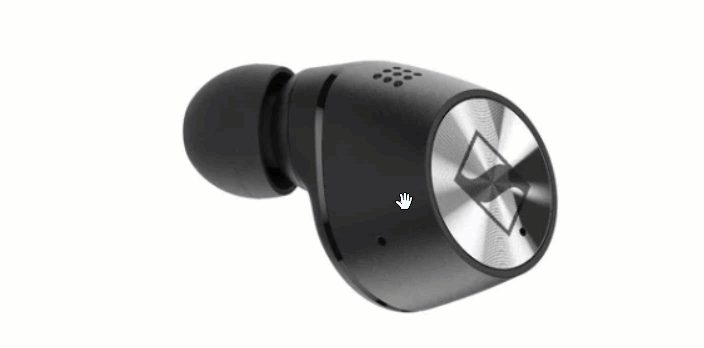

[](https://github.com/abdelrahmanmostafa21/flutter-cloudimage-360-view/releases)
[](https://pub.dartlang.org/packages/cloudimage-360-view)
[](#contributing)
[](https://opensource.org/licenses/MIT)
[](https://www.github.com/abdelrahmanmostafa21)

<p align="center">
		
	</a>
</p>

<h1 align="center">
   Flutter Cloudimage 360 View
</h1>


<p align="center">A simple, interactive resource that can be used to provide a virtual tour of your product.</p>
<p align="center">	
    
	

        
</p>

## <a name="table_of_contents"></a>Table of contents

* [Example](#example)
* [Installation](#installation)
* [How To Use](#how-to-use)
* [Image Model](#image-model)
* [Options](#options)
* [Controller](#controller)
* [Best practices](#best-practices)
* [Contributing](#contributing)
* [License](#license)


## <a name="example"></a> Example
To build and run the example app:

1. Get Flutter [here](https://flutter.dev) if you don't already have it
2. Clone this repository.
3. `cd` into the repo folder.
4. run `flutter run-android` or `flutter run-ios` to build the app.
- Please note that a Mac with XCode is required to build for iOS

>Example

<video 
    controls
    alt="ExampleVideo"
    type="video/mp4"
    height= 400
    src="./screenshots/example360.mp4">

## <a name="installation"></a>Installation

Add `cloudimage_360_view: 1.0.1` to your `pubspec.yaml` dependencies. 
>Import Package

```dart
import 'package:cloudimage_360_view/cloudimage_360_view.dart';
```
## <a name="how-to-use"></a> How To Use
>Simply create a `Ci360View` widget, and pass the required parameters:

* [Horizontal Model (xImageModel | __optional__ if (yAxis) provided](#image-model)
* [Vertical Model (yImageModel) | __optional__ if (xAxis) provided](#image-model)
* [Ci360Options (options)](#options)
```dart
Ci360View(
    xImageModel: Ci360ImageModel.horizontal(
        imageFolder: 'your image x folder - check Ci360ImageModel',
        imageName: (index) => '$index.jpg',
        imagesLength: 233,
    ),
    yImageModel: Ci360ImageModel.vertical(
        imageFolder: 'your image y folder - check Ci360ImageModel',
        imageName: (index) => 'imagename-y-$index.jpg',
        imagesLength: 36,
    ),
    options: Ci360Options(
        swipeSensitivity: 2,
        autoRotate: true,
        rotationCount: 5,
        allowSwipeToRotate: true,
        onImageChanged: (index, reason, axis) {},
    ),
)
```

## <a name="image-model"></a> Image Model 
###### Type: **class** | _required_
>Horizontal (X-Axis)
```dart
Ci360ImageModel.horizontal({
    required this.imageFolder,
    required this.imageName,
    required this.imagesLength,
  });
```
###### Type: **class** | _required_
>Vertical (Y-Axis)
```dart
Ci360ImageModel.vertical({
    required this.imageFolder,
    required this.imageName,
    required this.imagesLength,
  });
```
#### imageFolder
###### Type: **String** | _required_
Your images folder on your cloud/cdn.
Base Data Folder Url For the main image.
`i.e https://domain.com/images/360-tesla/`

#### imageName
###### Type: **Function** | _required_
The filename pattern for your 360 image in `x|y` Axis builder.
`String Function(int index)`
Must return a valid `String` path with the called `index`
which the library will call with a number between `1` and `imageLength` for axis `x|y`.
##### `i.e`
```dart
Ci360Options.horizontal({
    imageName: (index) => 'tesla-x-$index.jpg'
  });
```
```dart
Ci360Options.vertical({
    imageName: (index) => 'tesla-y-$index.jpg'
  });
```
#### imagesLength
###### Type: **int** | _required_
Amount of images to load in `x | y` axis for 360 view.
Must Be Valid Length To Get The Valid FileName Of The Image

## <a name="options"></a> Options 
###### Type: **class** | _required_

```dart
Ci360Options({
    this.autoRotate = false,
    this.allowSwipeToRotate = true,
    this.rotationCount = 1,
    this.swipeSensitivity = 3,
    this.frameChangeDuration = kShortDuration,
    this.rotationDirection = CIRotationDirection.clockwise,
    this.onImageChanged,
  });
```

#### autoRotate
###### Type: **bool** | Default: **false** | _optional_
If set to true, the images will be displayed in incremented manner.

#### allowSwipeToRotate
###### Type: **bool** | Default: **true** | _optional_
If set to false, the gestures to rotate the image will be disabed.

#### rotationCount
###### Type: **int** | Default: **1** | _optional_
The number of cycles the whole image rotation should take place.
`0` means infinite rotation.

#### swipeSensitivity
###### Type: **int** | Default: **3** | _optional_

Based on the value the sensitivity of swipe gesture increases and decreases proportionally.
`1` slow and increases speed by `+1`

#### `frameChangeDuration`
###### Type: **Duration** | Default: **Duration(milliseconds: 80)** | _optional_
The time interval between shifting from one image frame to other.

#### rotationDirection
###### Type: **CIRotationDirection** | Default: **CIRotationDirection.clockwise** | _optional_
Based on the value the direction of rotation is set.

#### onImageChanged
###### Type: **Function** | Default: **null** | _optional_
Callback `Function(int index, CIImageChangedReason reason, Axis axis)` to provide you the index of current image when image frame is changed with the image axis and reason.

## <a name="controller"></a> Controller

### Ci360Controller

###### Type: **class** | Default: **"Ci360ControllerImpl"** | _optional_

The controller of the ci360 package.
You can implement your own controllers
##### `i.e`
```dart
class CustomCi360Controller implements Ci360Controller {
 // Should Override this variables as below
 @override
  Completer readyCompleter = Completer();

  Ci360State? _state;

  @override
  set state(Ci360State? state) {
    _state = state;
    if (!readyCompleter.isCompleted) {
      readyCompleter.complete();
    }
  }
// Implement the required methods with your custom callbacks
// Then Pass Your Custom Controller To [Ci360View] widget.
}
```
>Methods
### nextImage
###### Type: **Function**
manually roate to next image.
### previousImage
###### Type: **Function**
manually roate to previous image.

### rotateToImage
###### Type: **Function** | Parameter: **( int index, [Axis axis = Axis.horizontal] )**
manually roate to specified index on specified axis.

### stopAutoPlay
###### Type: **Function**
manually stop auto rotate of images.
This is a more on-demand way of doing this. Use the `autoRotate`
parameter in `Ci360Options` to specify the autoRotate behaviour of the ImageView.

### startAutoPlay
###### Type: **Function**
manually start auto rotate of images.
The ImageView will only autoPlay if the `autoRotate` parameter
in `Ci360Options` is true.


## <a name="best-practices"/> Best practices
In order to use cloudimage 360 view, your original (master) images should be stored on a server
or storage bucket (S3, Google Cloud, Azure Blob...) reachable over
HTTP or HTTPS.


## <a name="contributing"></a>Contributing!

All contributions are super welcome!

## <a name="license"></a>License
Flutter Cloudimage 360 View is provided under the [MIT License](https://opensource.org/licenses/MIT)